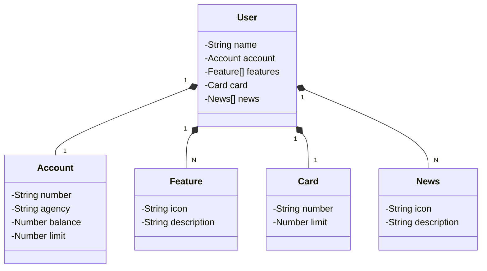

## Santander Dev Week 2023 | [DIO](https://web.dio.me/)
[Click here](https://alexandrelorena.github.io/index.html) to access my online resume.

---
Java RESTful API criada para a Santander Dev Week.

## Principais Tecnologias

---
- **Java 21**
- **Spring Boot 3**
- **Spring Data JPA**
- **OpenAPI (Swagger)**
- **Railway**
---

## Diagrama de classes

---
 

 

<!-- LinkedIn --> 
<a href="https://linkedin.com/in/alexandrelorena-developer" style="text-decoration:none;border:none;"> <svg xmlns="http://www.w3.org/2000/svg" width="32" height="32" viewBox="0 0 20 20"><path fill="#4D4D4D" d="M10 .4C4.698.4.4 4.698.4 10s4.298 9.6 9.6 9.6s9.6-4.298 9.6-9.6S15.302.4 10 .4M7.65 13.979H5.706V7.723H7.65zm-.984-7.024c-.614 0-1.011-.435-1.011-.973c0-.549.409-.971 1.036-.971s1.011.422 1.023.971c0 .538-.396.973-1.048.973m8.084 7.024h-1.944v-3.467c0-.807-.282-1.355-.985-1.355c-.537 0-.856.371-.997.728c-.052.127-.065.307-.065.486v3.607H8.814v-4.26c0-.781-.025-1.434-.051-1.996h1.689l.089.869h.039c.256-.408.883-1.01 1.932-1.01c1.279 0 2.238.857 2.238 2.699z"/></svg></a>
<!-- Steam --> 
<!-- &nbsp;  -->
<!-- StackOverflow --> 
  
<!-- CodeChef --> 
 
<!-- Codeforces --> 
 
<!-- LeetCode --> 
 
<!-- TopCoder --> 

